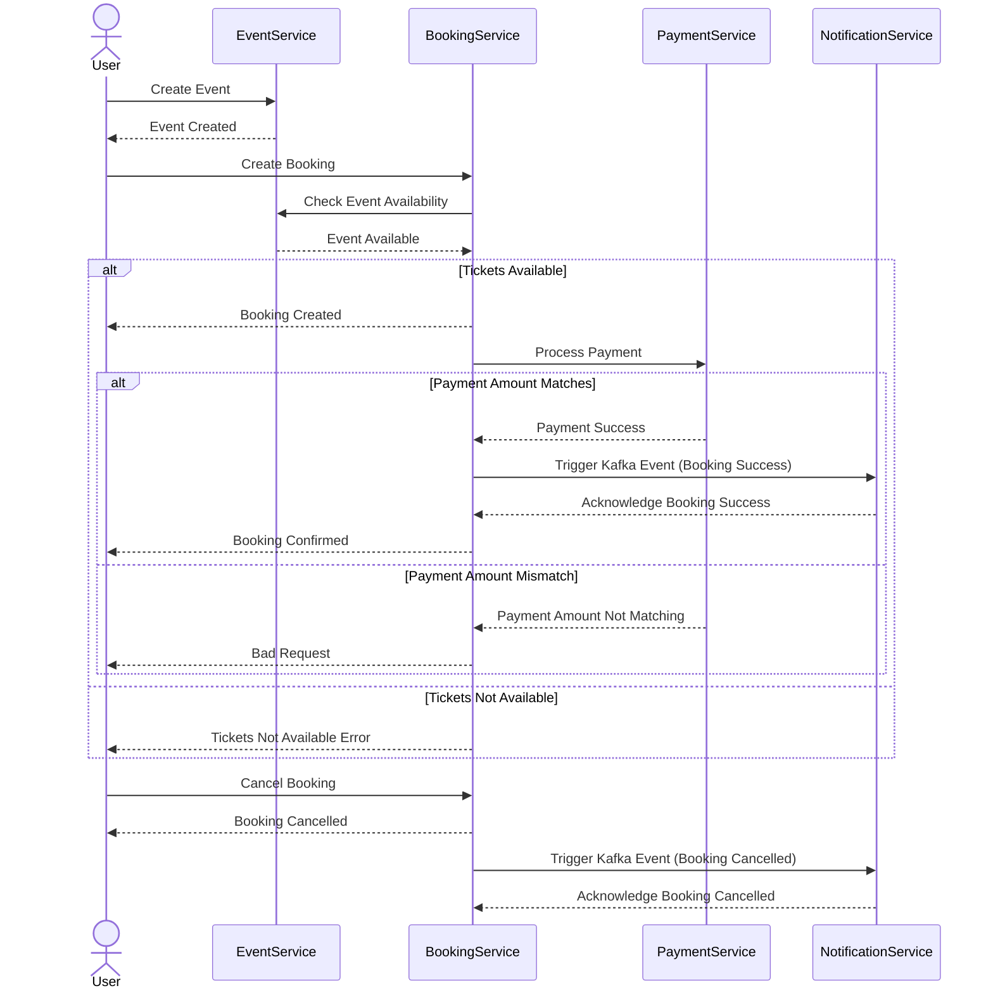

# Event Microservice 

This is a Spring Boot 3.3.2 application that uses H2 as its database.
Event can be saved with Event Name, Event Data, Event Location and with Tickets Details.

Other related microservices: 
* Booking Microservice
* Payment Microservice
* Notification Microservice

Swagger URL: http://localhost:8081/swagger-ui/index.html
Postman Collection: https://github.com/ShashiLakshan/event-service/blob/main/postman/event-booking.postman_collection.json

## Prerequisites

- Java 22 or later
- Maven 3.8.1 or later
- Docker (for Kafka)

## Getting Started

### Clone the Repository

```bash
git clone https://github.com/ShashiLakshan/event-service.git
cd event-service
```
### Run Kafka container
- This creates Kafka container to run the application
```bash
cd infrastructure
cd kafka
docker-compose up -d
```

### Building the Project
```bash
mvn clean install
```
### Running the Application
```bash
mvn spring-boot:run
```
The application will start and be accessible at http://localhost:8081.


This system allows users to create events, book tickets for events, and handle payments. The booking process includes ticket availability checks, payment processing, and notifications for successful bookings and cancellations.

## Sequence Diagram



## REST APIs

### POST /api/v1/events
#### Request
```json
{
  "eventName": "Sample Event 12",
  "eventDate": "2024-11-28 12:00:00",
  "eventLocation": "Colombo",
  "tickets": [
    {
      "ticketType" : "VIP",
      "noOfTickets" : 10,
      "unitPrice" : 100

    },
    {
      "ticketType" : "REGULAR",
      "noOfTickets" : 10,
      "unitPrice" : 20

    }
  ]
}
```
#### Response
```json
{
  "eventId": 1,
  "eventName": "Sample Event 12",
  "eventDate": "2024-11-28 12:00:00",
  "eventLocation": "Colombo",
  "tickets": [
    {
      "ticketId": 1,
      "ticketType": "REGULAR",
      "noOfTickets": 10,
      "unitPrice": 20
    },
    {
      "ticketId": 2,
      "ticketType": "VIP",
      "noOfTickets": 10,
      "unitPrice": 100
    }
  ]
}
```

### GET /api/v1/events
#### Response
```json
[
  {
    "eventId": 1,
    "eventName": "Sample Event 12",
    "eventDate": "2024-11-28 12:00:00",
    "eventLocation": "Colombo",
    "tickets": [
      {
        "ticketId": 2,
        "ticketType": "VIP",
        "noOfTickets": 10,
        "unitPrice": 100.00
      },
      {
        "ticketId": 1,
        "ticketType": "REGULAR",
        "noOfTickets": 10,
        "unitPrice": 20.00
      }
    ]
  }
]
```


### GET /api/v1/events/{id?
#### Response
```json
{
  "eventId": 1,
  "eventName": "Sample Event 12",
  "eventDate": "2024-11-28 12:00:00",
  "eventLocation": "Colombo",
  "tickets": [
    {
      "ticketId": 1,
      "ticketType": "REGULAR",
      "noOfTickets": 10,
      "unitPrice": 20.00
    },
    {
      "ticketId": 2,
      "ticketType": "VIP",
      "noOfTickets": 10,
      "unitPrice": 100.00
    }
  ]
}
```
### PATCH /api/v1/events/{id}
#### Request
```json
{
  "eventId": 1,
  "eventName": "Sample Event 12",
  "eventDate": "2024-11-28 12:00:00",
  "eventLocation": "Galle"
}
```
#### Response
```json
{
  "eventId": 1,
  "eventName": "Sample Event 12",
  "eventDate": "2024-11-28 12:00:00",
  "eventLocation": "Galle",
  "tickets": [
    {
      "ticketId": 1,
      "ticketType": "REGULAR",
      "noOfTickets": 10,
      "unitPrice": 20.00
    },
    {
      "ticketId": 2,
      "ticketType": "VIP",
      "noOfTickets": 10,
      "unitPrice": 100.00
    }
  ]
}
```
### POST /api/v1/events/search
#### Request
```json
{
  "eventName": "Sample Event",
  "eventDate": "2024-08-28 12:00:00",
  "eventLocation": "Galle"
}
```
#### Response
```json
[
  {
    "eventId": 1,
    "eventName": "Sample Event 12",
    "eventDate": "2024-11-28 12:00:00",
    "eventLocation": "Galle",
    "tickets": [
      {
        "ticketId": 1,
        "ticketType": "REGULAR",
        "noOfTickets": 10,
        "unitPrice": 20.00
      },
      {
        "ticketId": 2,
        "ticketType": "VIP",
        "noOfTickets": 10,
        "unitPrice": 100.00
      }
    ]
  }
]
```
### DELETE /api/v1/events/{id}
#### Response
```json
200 OK
```
